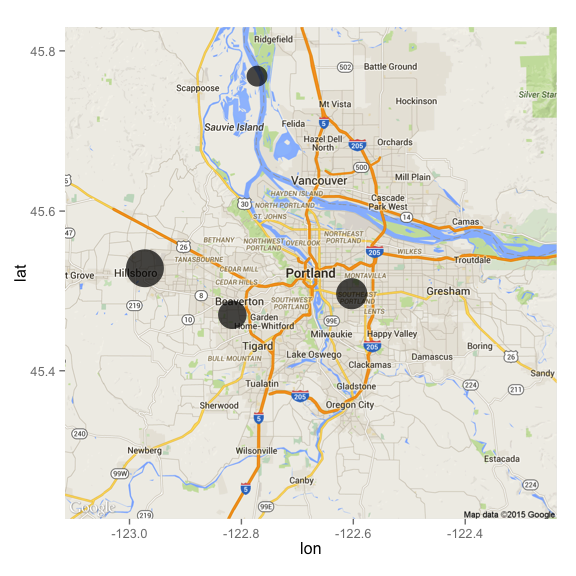

# Read Me
Makoto Kelp  
May 9, 2015  

On a national scale, Portland, OR is fairly under monitored when it comes to its air quality. There have been efforts by the Oregon Department of Environmental Quality (DEQ) and other smaller institutions, such as Reed College, to help ameliorate this issue of under coverage. In today's world with such "hot topic" and contentious issues as global warming and its concomitant public health concerns, monitoring the quality of our air is as important as ever.    

This analysis explores the spatial and temporal distributions of fine particulate matter (PM 2.5), an environmental pollutant produced from incomplete and inefficient combustion. PM 2.5 is known to cause deleterious health effects from asthma exacerbation to higher rates of mortality in men, women, and children. 

We aim to unpack trends and correlations relating to fine PM and determine who is at risk from this pollution. 

Below is an example map of Portland, OR in winter of 2014 where the size of the circles represent the monitored concentration of the PM 2.5 in micrograms/m3 and the location of the circles is the specific DEQ monitoring site. 

##PDX Map Winter 2014
 

