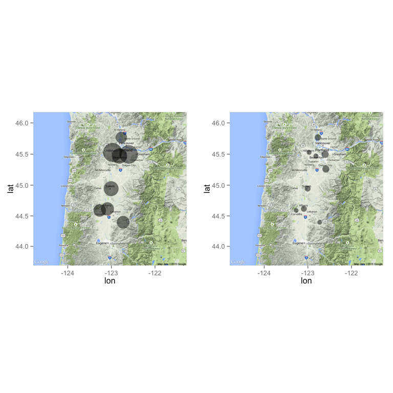

# Spatial and Temporal Trends of Fine Particulate Matter in Western Oregon
Makoto Kelp  
May 11, 2015  

The purpose of this project is to explore the spatial and temporal distributions of particulate matter. This goal is accomplished through the graphical representation of time series data and maps. Aerosols are the total amount of suspended solid and liquid particles in the air. This mixture of particles contains inorganic and organic components (organic meaning carbon-composed and inorganic meaning non-carbon-composed molecules), both from natural and anthropogenic sources. PM 2.5 or fine PM (a class of aerosols) will be the focus of this analysis. The 2.5 refers to the diameter of the particle in micrometers. PM 2.5 is indiscernible to the human eye (thus the "fine" designation). Fine PM may form from inefficient combustion due to motor vehicles, residential wood burning, and other local industrial processes. Fossil fuel combustion is the burning of hydrocarbon fuel in addition to oxygen, which yields carbon dioxide, water, and heat as energy:

$$H_{x}C_{x} + O_{2}  \rightarrow H_{2}O + CO_{2} + heat + Particulate Matter$$

However, not all engines combust their fuels cleanly and completely and therefore additional PM combustion products including soot and exhaust, which may comprise volatile organics, are produced.

One may ask why may we care about PM2.5? Perhaps most immediately because fine PM is an environmental health hazard. It has the potential to cause a slew of different health effects from asthma exacerbation to higher rates of mortality in men, women, and children. The pollutant also has certain atmospheric climate effects such as global warming and regional cooling.   

The raw PM data (CSV) was supplied by Anthony Barnack from the Oregon Department of Environmental Quality (DEQ). The data comes from nine different monitoring sites from around Western Oregon from locations such as Sauvie Island to Salem. All data have been collected by particulate matter monitoring instruments such as a DustTrak and AeroTrak. The data ranges over a two year period from January 2013 to February 2015 (only up to November 2014 used to compare two years, 8 seasons). PM and other air quality pollutant data may be obtained from the DEQ upon request.  

The following report contains a temporal and spatial analysis of fine PM data from Western Oregon. 

##Exploratory Data Visualization Analysis

Perhaps some exploratory data visualization is needed. Below is a plot of the two year monitored time period for the SE Lafayette Portland site. From a quick glance we can see that there is a cyclic pattern to the data. PM seems to peak in the winter months and has a trough in the summer months. This shape is due to the fact that there is more combustion activity in the winter (think home heating) than in the summer. If we assume that PM's sink is deposition and assume the same rate of deposition for all seasons, then it makes sense that the season with the highest rate of production (winter) will have higher overall concentrations. Perhaps for the more scientific inclined readers the following explanation from the EPA might warrant additional thought:

"Fine particles also have seasonal patterns... Fine particle concentrations tend to be higher in the fourth calendar quarter (October-December) in many areas of the West, in part because fine particle nitrates are more readily formed in cooler weather, and wood stove and fireplace use produces more carbon." (Source: http://cfpub.epa.gov/eroe/index.cfm?fuseaction=detail.viewPDF&ch=46&lShowInd=0&subtop=341&lv=list.listByChapter&r=231331)

One must also note that PM is highly susceptible to specific source events that can drive the average up for a period of time (such as a fire or congregation of old diesel trucks).  

 

##Seasonal Variations in Fine PM

Note below the comparison of eight monitoring sites in Western Oregon during winter 2013 (there was no data for the Carus site during this time period). For the sake of this analysis the seasons are defined: winter is from Dec to Feb (Dec is excluded for winter 2013 due to no data); spring is from Mar to May; summer is from June to Aug; and fall is from Sep to Nov. This hopefully is the most accurate method to represent the seasons, it allows us to use most all of the data over two years provided to us. Also note that gaps have purposefully been included in these graphs to make aware of the missing data at these sites. 

##Winter 2013

Note that winter 2013 has a PM range from 0 to around 40 micrograms/m3. One may also notice that although the sites are spatially spread, the PM peaks seem to line up at all the sites. Notice that there is a unified local maxima peak on around Jan 12. One may propose that this may be due to elevated levels of combustion in the area during this period or perhaps even more creative interpretations such as Sunday "Church traffic" coupled with the local public schools starting back up again creating more activity in the area. To be sure, there is no one right answer as to why there is a peak event in the region during this time.  

 

##Spring 2013

Continuing our analysis for the spring 2013 season, the reader may realize a noticeable change. The magnitude of PM 2.5 has dramatically been reduced from a range of 0-~40 to that of 0-~25. This change is most likely due to the reduction of combustion in the region due to people using less heating for their homes. 

 

##Summer 2013

Perhaps the most interesting comparison would be that between summer and winter. Viewing the below plot, we can see a change in axes in order to view the data in a more appropriate and meaningful fashion. The range of PM concentration is even smaller than spring, with a range from 0 to ~10 micrograms/m3. This drastic reduction is due to presumably little to no combustion due to heating homes and the elevated temperature which reduces the formation of fine particulate nitrate and other specific PM components that contribute to the overall monitored concentration. 

 

##Fall 2013

Finally, for the sake of thoroughness, fall 2013 PM concentrations are below. The range of the PM data is from 0 to 40 micrograms/m3 which is the same as that for winter, but notice that most of that range is attributed to the increasing peak found at the end of the season. Also note that this increasing peak is found in all the graphs (except Carus which has no data during that time). We may strongly suggest that PM is highly correlated from site to site, as they track specific trends very well. 

 

## Summary Statistics for Seasonal Averages

From viewing the tables below we can see that on average the SE Lafayette site in Portland produces the highest concentration of PM for the year. This is most likely due to the fact that this site is the most urban of all the monitoring sites and thus has the highest amount of combustion activity and therefore pollution. Because this site seems to be the most interesting to us at Reed College for multiple reasons, such as proximity and acts as a "ceiling" for the other sites, we will use the Lafayette site to compare variation over years.  

Table: Winter 2013 Monthly Averages

na.rm      Albany   Beaverton   Carus   Corvallis   Hillsboro   Lafayette      Salem     Sauvie   SweetHome
------  ---------  ----------  ------  ----------  ----------  ----------  ---------  ---------  ----------
TRUE     9.069303    10.59581     NaN    8.605113    12.98534     12.7897   10.28486   7.873078     8.79136

Table: Spring 2013 Monthly Averages

na.rm      Albany   Beaverton   Carus   Corvallis   Hillsboro   Lafayette      Salem     Sauvie   SweetHome
------  ---------  ----------  ------  ----------  ----------  ----------  ---------  ---------  ----------
TRUE     4.453342    4.008013     NaN    3.244684    4.639331    5.577359   4.701053   4.290294    3.911172

Table: Summer 2013 Monthly Averages

na.rm      Albany   Beaverton     Carus   Corvallis   Hillsboro   Lafayette      Salem     Sauvie   SweetHome
------  ---------  ----------  --------  ----------  ----------  ----------  ---------  ---------  ----------
TRUE     4.054258    3.543086   4.79918    3.166856    3.329494    4.928186   4.009524   4.414915    3.149634

Table: Fall 2013 Monthly Averages

na.rm      Albany   Beaverton     Carus   Corvallis   Hillsboro   Lafayette      Salem     Sauvie   SweetHome
------  ---------  ----------  --------  ----------  ----------  ----------  ---------  ---------  ----------
TRUE     11.30843    8.745417   4.13625    9.447206     11.3031    10.64925   11.83103   7.757759    9.392697

##Temporal Variations for SE Lafayette, Portland

Unfortunately from the seasonal plots below for the Lafayette site we cannot conclude much about specific in-season patterns about fine PM. We can see a general consistency for the magnitude of our pollutant, but not much about a cyclic in-season pattern. The local minima and maxima of peaks seem to be random except for the increasing peak found at the end of fall for both 2013 and 2014, which is due more to a general annual-seasonal pattern and not that of a within season pattern. Perhaps one may suggest that PM is highly dependent on individual events and are essentially regionally determined and that there is not a predetermined in-season pattern that is apparent.  

 

##Particulate Matter Maps of Western Oregon

The following are maps of the PM monitoring sites in Western Oregon. The circles are located at the areas of the sites and the size of the circles relates to the measured concentration of particulate matter for that site during the specified season.  

##Summer 2013
 

  
##Winter 2013
 

##2013 Summer, Winter Comparison
 

At this point, perhaps it is obvious to the reader that there is a seasonal difference for PM concentration. However, the above map is a nice visual to understand that PM is a product of incomplete combustion and that that process is most likely to happen in urban areas, i.e., Portland. Notice that the size of the concentric circles are much larger in the Portland metro area than it is for that of Salem and Corvallis. This difference is due to the elevated industrial and commercial activity found in urban centers.  

##Portland Specific Visual

Because Reed College is situated on the banks of the Willamette River and near downtown Portland, it seems appropriate to create a visual that deals with the particulate matter monitoring sites found in the Portland metro area. Because our last comparison was using 2013 data, let us employ 2014 data for a change. 

##PDX Map Summer 2014
 

##PDX Map Winter 2014
 

##PDX Summer, Winter 2014
 

##Conclusions

From our exploratory analysis, we can interpret some trends for PM 2.5. We understand that PM is highly variable depending on the region. It seems as though the trend for Oregon and presumably the Pacific Northwest is a peak in the winter and a trough in the summer due to combustion activity and favorable temperatures for fine particle nitrates (a specific component of particulate matter). From our data, we were not able to necessarily conclude a specific within-season pattern for the monitoring sites, although the persistent increasing peak at the end of fall may be considered an in-season pattern, but is more likely the result of the  general annual-seasonal pattern changing from fall to winter. We can also conclude that urban areas produce more PM because of a greater presence of combustion via industrial and residential activity. 

Perhaps a component that cannot necessarily be touched upon with simple summary statistics is the role of peak events. We have used seasonally averaged data to use for our concentrations on our maps. However, these average concentrations do not account for specific point sources that can be hazardous to health. 

For example, referencing the winter 2013 fine PM data for the SE Lafayette site, we notice that there was a monthly average of 12.7897 micrograms/m3. However, if we view the time series plot we notice a large peak event on Jan 12 that has a value of 42.000 micrograms/m3. If we employ North Carolina's Department of Environment and Natural Resources guideline for PM2.5 air quality (http://daq.state.nc.us/airaware/forecast/pm_codecalc.shtml)
, a 12.7897 microgram concentration yields a "green" level of health concern while a 42.000 microgram concentration yields an "orange" level of health concern. These colors are according to the EPA's Air Quality Index (AQI) guide (http://www.airnow.gov/index.cfm?action=aqi_brochure.index), where green is "good" and "orange" is "unhealthy for sensitive groups". With this understanding that health concerns are driven by specific source events, one may realize that monthly averages may be deceptive. Although averages are important in terms of EPA and government monitoring of overall air quality, one must understand that specific events close to individuals are the true concern of health hazards. 

These results apply to the Reed College community and the population of the Portland metro area. This analysis was simply a general overview regarding the sources, monitoring, and interpretation of fine particulate matter data. A plausible extension to this analysis would potentially include an ARIMA (Autoregressive Integrated Moving Average) calculation that may help determine the "staying power" of a pollutant, that is, its potential atmospheric lifetime.  

